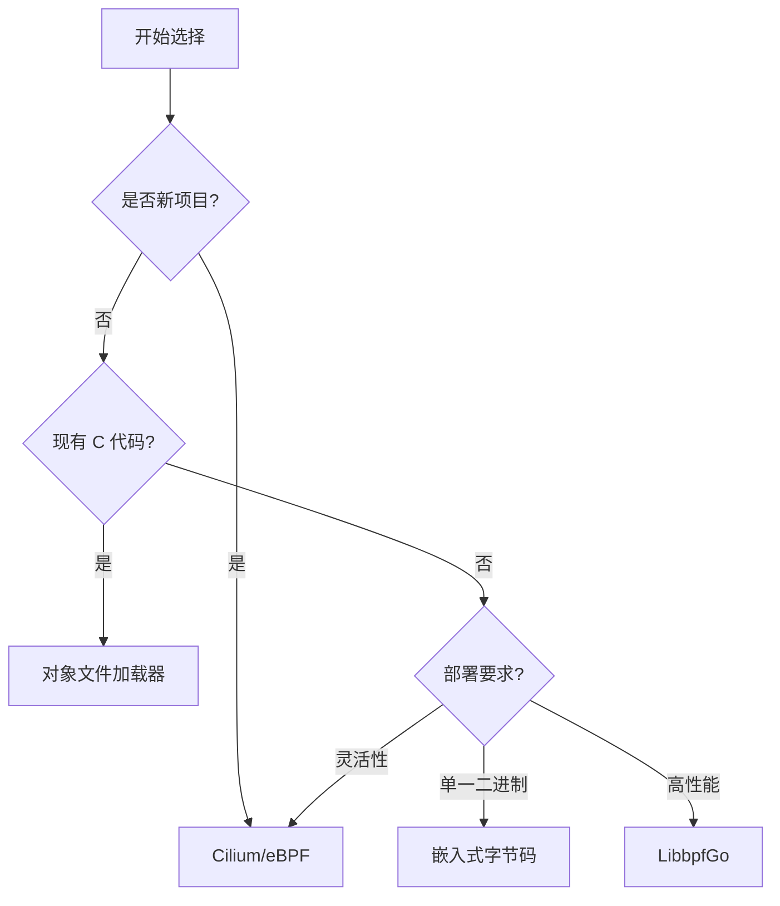

# Go eBPF 实现对比分析

KubeNetProbe 项目提供了四种不同的 Go 语言 eBPF 实现方案，每种方案都有其独特的优势和适用场景。

## 🔧 实现方案对比

### 1. Cilium/eBPF (推荐) 📡

**优势：**
- ✅ 纯 Go 实现，无需 CGO
- ✅ 类型安全的 Map 操作
- ✅ 现代化的 API 设计
- ✅ 活跃的社区支持
- ✅ 良好的错误处理
- ✅ 支持程序热重载

**劣势：**
- ❌ 需要单独编译 eBPF C 程序
- ❌ 学习曲线相对陡峭

**适用场景：**
- 新项目开发
- 需要类型安全的场景
- 云原生环境
- 生产环境部署

**示例代码：**
```go
monitor, err := ebpf.NewNetworkMonitor()
if err != nil {
    return err
}
defer monitor.Close()

if err := monitor.AttachToInterface("eth0"); err != nil {
    return err
}

stats, err := monitor.GetPacketStats()
```

### 2. 对象文件加载器 📁

**优势：**
- ✅ 支持预编译的 eBPF 程序
- ✅ 灵活的程序加载机制
- ✅ 支持动态程序替换
- ✅ 与现有 C 代码兼容

**劣势：**
- ❌ 需要管理外部对象文件
- ❌ 部署复杂度较高
- ❌ 运行时依赖

**适用场景：**
- 已有 eBPF C 程序
- 需要动态加载程序
- 开发测试环境

**示例代码：**
```go
loader := ebpf.NewEBPFLoader()
defer loader.Close()

if err := loader.LoadFromObjectFile("./network-monitor.o"); err != nil {
    return err
}

if err := loader.AttachXDP("network_monitor_xdp", "eth0"); err != nil {
    return err
}
```

### 3. 嵌入式字节码 📦

**优势：**
- ✅ 单一二进制部署
- ✅ 无外部依赖
- ✅ 快速启动
- ✅ 容器友好

**劣势：**
- ❌ 程序无法动态更新
- ❌ 二进制文件较大
- ❌ 调试困难

**适用场景：**
- 容器化部署
- 嵌入式系统
- 分发简化需求

**示例代码：**
```go
//go:embed bin/ebpf/network-monitor.o
var networkMonitorBytes []byte

loader := ebpf.NewEmbeddedLoader()
if err := loader.LoadFromBytes(networkMonitorBytes); err != nil {
    return err
}
```

### 4. LibbpfGo 包装器 🔧

**优势：**
- ✅ 接近原生 libbpf 性能
- ✅ 丰富的功能支持
- ✅ 与 C 生态兼容
- ✅ 成熟稳定

**劣势：**
- ❌ 需要 CGO
- ❌ 交叉编译困难
- ❌ 依赖系统库

**适用场景：**
- 性能敏感场景
- 需要高级 eBPF 功能
- 与 C 代码集成

**示例代码：**
```go
monitor := ebpf.NewLibbpfGoMonitor()
defer monitor.Close()

if err := monitor.LoadFromObjectFile("./network-monitor.o"); err != nil {
    return err
}

if err := monitor.AttachXDP("network_monitor_xdp", "eth0"); err != nil {
    return err
}
```

## 🎯 选择指南

### 开发阶段选择



### 生产环境建议

| 场景         | 推荐方案       | 理由               |
| ------------ | -------------- | ------------------ |
| **云原生**   | Cilium/eBPF    | 类型安全、易维护   |
| **容器化**   | 嵌入式字节码   | 单一二进制、易分发 |
| **高性能**   | LibbpfGo       | 接近原生性能       |
| **快速迭代** | 对象文件加载器 | 支持热更新         |

## 🚀 快速开始

### 环境配置

```bash
# 安装必要的工具
sudo apt update
sudo apt install -y llvm clang libbpf-dev

# 设置 Go 环境
go mod init kube-net-probe
go mod tidy
```

### 选择实现方式

```bash
# 使用 Cilium/eBPF (推荐)
export EBPF_IMPLEMENTATION=cilium
sudo ./examples/go_ebpf_monitor

# 使用对象文件加载器
export EBPF_IMPLEMENTATION=object
sudo ./examples/go_ebpf_monitor

# 使用嵌入式实现
export EBPF_IMPLEMENTATION=embedded
sudo ./examples/go_ebpf_monitor

# 使用 LibbpfGo
export EBPF_IMPLEMENTATION=libbpfgo
sudo ./examples/go_ebpf_monitor
```

### 构建和测试

```bash
# 编译 eBPF 程序
make build-ebpf

# 构建 Go 程序
make build

# 运行测试
make test

# 运行完整测试套件
make test-integration
```

## 📊 性能对比

| 实现方式    | 启动时间 | 内存占用 | CPU 开销 | 部署复杂度 |
| ----------- | -------- | -------- | -------- | ---------- |
| Cilium/eBPF | ⭐⭐⭐⭐     | ⭐⭐⭐⭐     | ⭐⭐⭐⭐     | ⭐⭐⭐        |
| 对象加载器  | ⭐⭐⭐      | ⭐⭐⭐      | ⭐⭐⭐⭐     | ⭐⭐         |
| 嵌入式      | ⭐⭐⭐⭐⭐    | ⭐⭐⭐      | ⭐⭐⭐⭐     | ⭐⭐⭐⭐⭐      |
| LibbpfGo    | ⭐⭐⭐      | ⭐⭐⭐⭐⭐    | ⭐⭐⭐⭐⭐    | ⭐⭐         |

## 🔍 故障排查

### 常见问题

1. **权限问题**
   ```bash
   # 确保以 root 权限运行
   sudo ./your-program
   ```

2. **内核版本兼容性**
   ```bash
   # 检查内核版本
   uname -r
   # 需要 >= 4.18
   ```

3. **eBPF 功能支持**
   ```bash
   # 检查 eBPF 支持
   sudo bpftool prog list
   sudo bpftool map list
   ```

4. **网络接口问题**
   ```bash
   # 列出网络接口
   ip link show
   # 设置接口环境变量
   export NETWORK_INTERFACE=eth0
   ```

## 📚 延伸阅读

- [eBPF 官方文档](https://ebpf.io/what-is-ebpf/)
- [Cilium/eBPF 库文档](https://pkg.go.dev/github.com/cilium/ebpf)
- [LibbpfGo 项目](https://github.com/aquasecurity/libbpfgo)
- [Kubernetes 网络深入理解](https://kubernetes.io/docs/concepts/cluster-administration/networking/)

通过这些 Go 语言实现，您可以完全替代原来的 C 代码，并根据具体需求选择最适合的方案。每种实现都经过精心设计，确保既保持了 eBPF 的高性能特性，又提供了 Go 语言的开发便利性。
